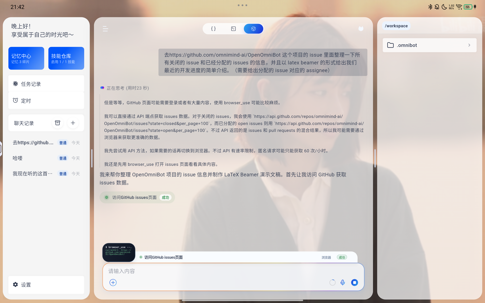

<p align="center">
  <picture>
    
  </picture>
</p>

<h3 align="center">
你的端侧 AI 助手
</h3>

<div align="center">
  
  <a href="https://github.com/omnimind-ai/OpenOmniBot/releases/latest"></a>
  <br>
  <a href="https://omnimind.com.cn"></a>
  <a href="https://linux.do"></a>
  <a href="#其他">
    
  </a>
</div>

<p align="center">
| 
<a href="#-demo"><b>Demo</b></a> 
| 
<a href="#-快速开始"><b>Quick Start</b></a> 
| 
<a href="https://github.com/omnimind-ai/OpenOmniBot/releases"><b>Release</b></a> 
|
<a href="https://github.com/omnimind-ai/OmniInfer-LLM/issues"><b>Issues</b></a> 
|
</p>

## ✨ 项目简介
OpenOmniBot 是一个基于 Android 原生与 Flutter 混合架构的智能机器人助手应用。
与传统 AI App 不同，它关注的是：**从理解 → 决策 → 执行 → 反馈的完整闭环**, 是一个 Android 端真正可“执行”的 Agent。

## 🧠 核心能力：

- 🧩 **工具生态扩展**：Skills、Alpine 系统、浏览器、MCP、安卓系统工具...

- 📱 **手机任务自动化**：支持用视觉模型操作手机界面。

- ⏰ **系统级能力**：支持定时任务、闹钟提醒、日历事件创建/查询/修改、音频播放控制。

- 🧬 **记忆系统**：短期与长期记忆嵌入。

- 🔨 **生产力工具**：支持读写文件、浏览工作区、调用浏览器、调用终端。


## 🚀 开发指南

### 环境要求

- Flutter SDK (3.9.2+)
- JDK 11+

### 获取代码

```bash
git clone https://github.com/omnimind-ai/OpenOmniBot.git
cd OpenOmniBot

#安装 Flutter 依赖
cd ui
flutter pub get
cd ..
```

### 构建并安装
```bash
./gradlew :app:installDevelopDebug
```
### 配置

在APP的设置页中配置：

- 模型提供商

- 场景模型配置

- MCP工具

- Alpine 环境与自启动终端


## 🧪 Demo
<table width="100%">
  <tr>
    <td width="20%" align="center">
      <div>
        <p><strong>下载抖音视频Skill演示</strong></p>
        <video src="https://github.com/user-attachments/assets/8dbe772a-b300-4d52-9428-c3030fbf97a8" controls="controls" style="max-width: 100%;"></video>
      </div>
    </td>
    <td width="20%" align="center">
      <div>
        <p><strong>手机任务执行</strong></p>
        <video src="https://github.com/user-attachments/assets/a9a22755-e6fb-43d9-8647-1bc62549a1da" controls="controls" style="max-width: 100%;"></video>
      </div>
    </td>
    <td width="20%" align="center">
      <div>
        <p><strong>定时任务演示</strong></p>
        <video src="https://github.com/user-attachments/assets/9bc78501-55ab-4c41-837d-5b8c6589e352" controls="controls" style="max-width: 100%;"></video>
      </div>
    </td>
    <td width="20%" align="center">
      <div>
        <p><strong>原生OpenClaw演示</strong></p>
        <video src="https://github.com/user-attachments/assets/45b235ae-17fb-4af6-89f0-03419a063441" controls="controls" style="max-width: 100%;"></video>
      </div>
    </td>
  </tr>
</table>

## 🏗️ 架构概览
```
OpenOmniBot/
├── app/                 # Android 主宿主模块：App 入口、Agent 编排、系统能力、MCP、前台服务
├── ui/                  # Flutter UI 模块：聊天、设置、任务、记忆等界面（Riverpod + GoRouter）
├── baselib/             # 基础核心库：数据库、网络、存储、模型配置、OCR、权限、设备信息
├── assists/             # 自动化执行引擎：任务调度、状态机、视觉检测、操作控制
├── accessibility/       # 无障碍与屏幕感知：Accessibility Service、截图、MediaProjection
├── omniintelligence/    # 智能能力抽象层：模型协议、任务状态、Agent 请求/响应模型
└── uikit/               # 原生浮窗/覆盖层 UI：Overlay、悬浮球、半屏面板
```

## 其他
感谢 linux.do 等社区的开发者的支持；
感谢优秀的开源项目：https://github.com/RohitKushvaha01/ReTerminal

<table align="center">
  <tr>
    <td align="center">
      <br/>
      <b>WeChat Group</b>
    </td>
  </tr>
</table>