<p align="center">
  <picture>
    
  </picture>
</p>

<p align="center">
  <a href="README.md"><b>English</b></a> |
  <a href="README.zh-CN.md"><b>简体中文</b></a>
</p>

<h3 align="center">
Your On-Device AI Assistant
</h3>

<div align="center">
  
  <a href="https://github.com/omnimind-ai/OpenOmniBot/releases/latest"></a>
  <br>
  <a href="https://omnimind.com.cn"></a>
  <a href="https://linux.do"></a>
  <a href="#community">
    
  </a>
</div>

<p align="center">
|
<a href="#use-cases"><b>Demo</b></a>
|
<a href="#quick-start"><b>Quick Start</b></a>
|
<a href="https://github.com/omnimind-ai/OpenOmniBot/releases"><b>Release</b></a>
|
<a href="https://github.com/omnimind-ai/OpenOmniBot/issues"><b>Issues</b></a>
|
</p>

> Unlike traditional mobile AI chat apps, OpenOmniBot runs directly on your device and can operate your Android phone like a human, including apps, gestures, and system settings.

OpenOmniBot is an on-device AI agent built with native Android Kotlin and Flutter. Instead of stopping at chat, it focuses on the full loop of **understand -> decide -> execute -> reflect**.

<h2 id="core-capabilities">Core Capabilities</h2>

- **Extensible tool ecosystem**: Skills, Alpine environment, browser access, MCP, and Android system-level tools.
- **Phone task automation**: Uses vision models to understand and operate mobile interfaces.
- **System-level actions**: Supports scheduled tasks, alarms, calendar creation/query/update, and audio playback control.
- **Memory system**: Short-term and long-term memory with embedding support.
- **Productivity tools**: Read and write files, browse the workspace, use the browser, and access the terminal.

<h2 id="quick-start">Quick Start</h2>

<p align="center">
  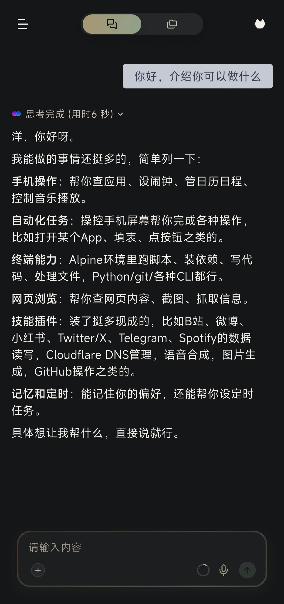
</p>

### Configure the app

Open the settings page from the left sidebar:

<p align="center">
  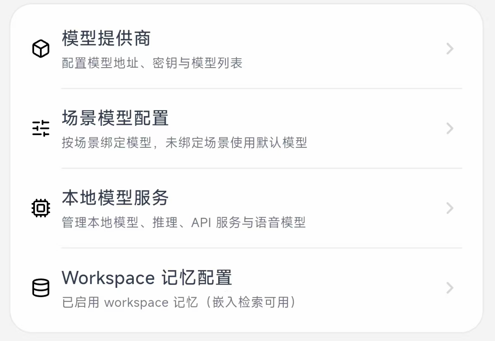
  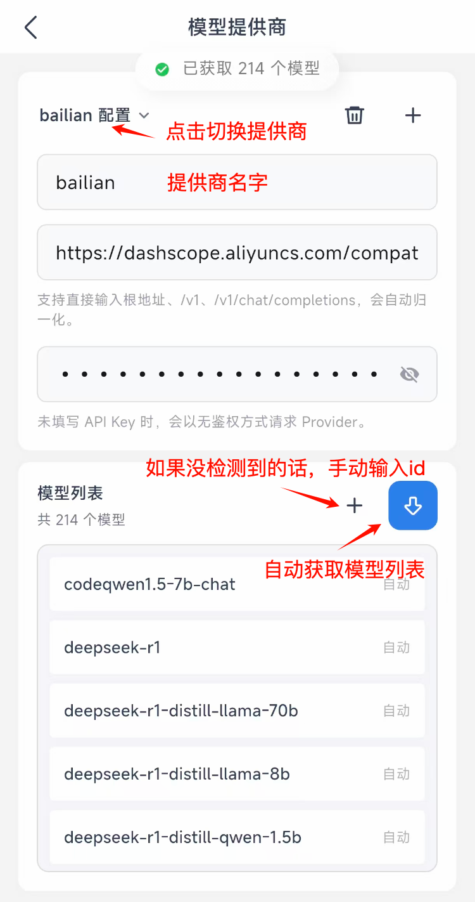
</p>

Then open the scenario model settings:

<p align="center">
  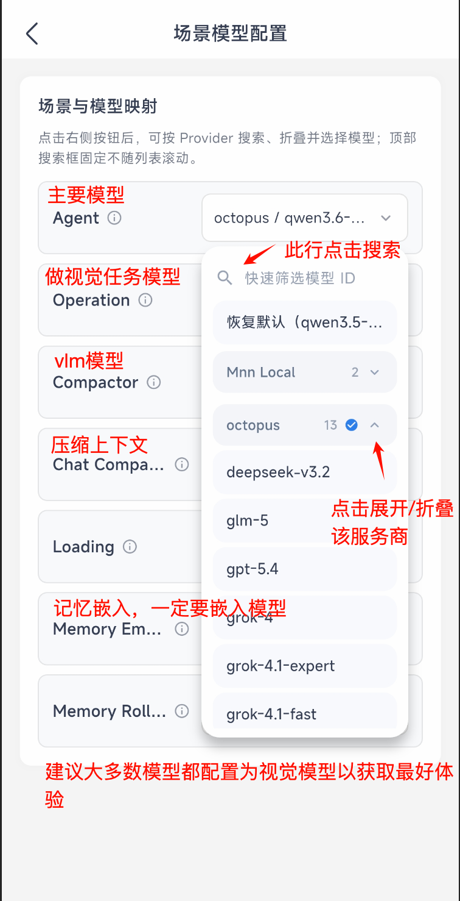
</p>

Note: `Memory embedding` requires an embedding model. For the best overall experience, the other scenarios should use multimodal or vision-capable models whenever possible.

<p align="center">
  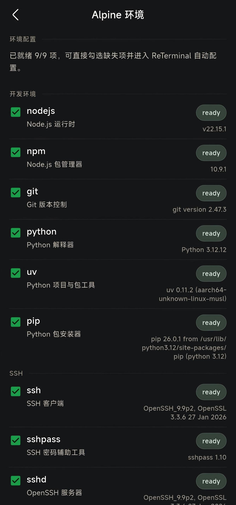
</p>

The app usually initializes the Alpine environment automatically on startup, and you can also manage that environment from the same settings area.

<h2 id="use-cases">Use Cases</h2>

### Skills

You can ask OmniBot to install a skill by simply sending it the repository link. Recommended collection: https://github.com/OpenMinis/MinisSkills

Enable or disable skills from the skill repository:

<p align="center">
  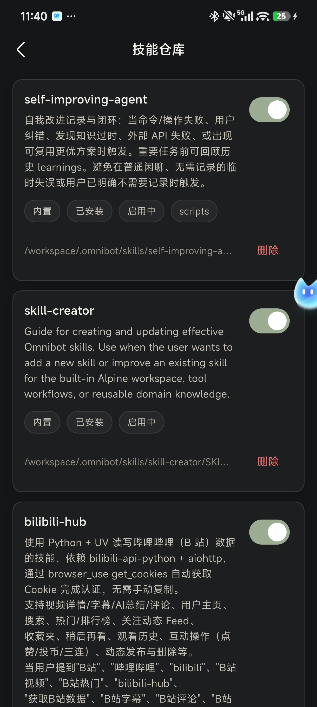
  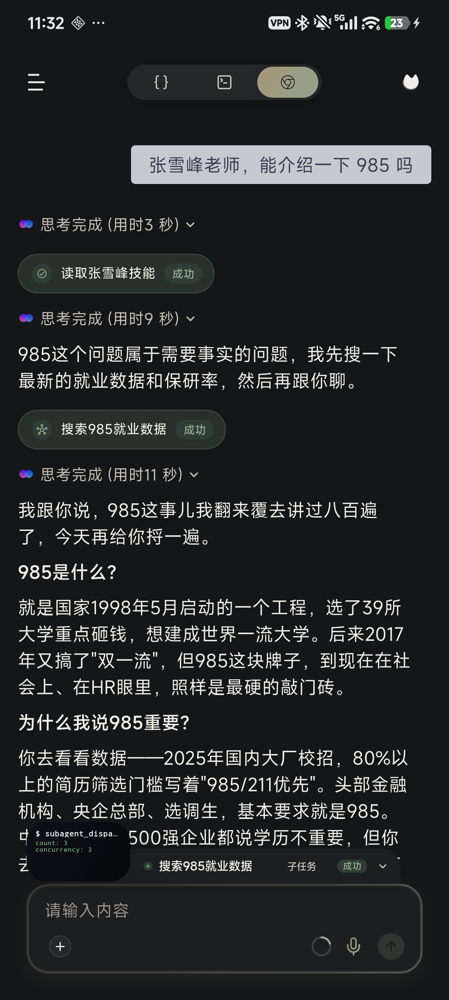
</p>

### VLM tasks

<p align="center">
  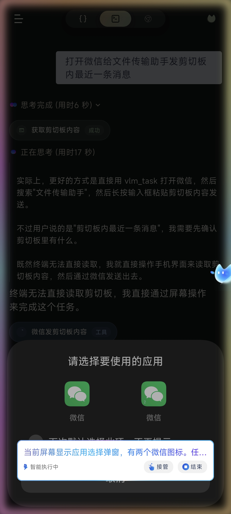
</p>

Before starting a task, open the chat page and grant all required permissions from the top-right corner.

### Local model inference

<p align="center">
  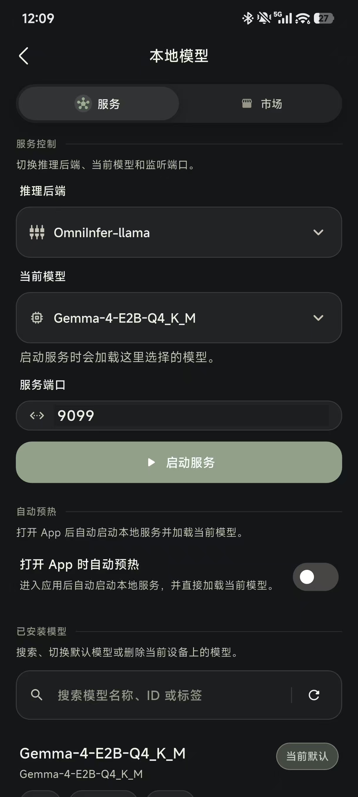
</p>

Supports both MNN and llama backends.

### Scheduled tasks

<p align="center">
  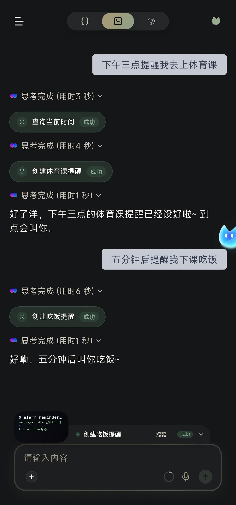
  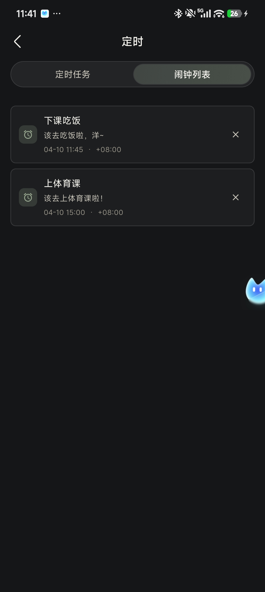
</p>

Scheduled tasks can execute work such as VLM tasks and subagent flows. Alarms are reminder-only. A subagent can be assigned a complete task and behaves like a full agent.

### Browser

<p align="center">
  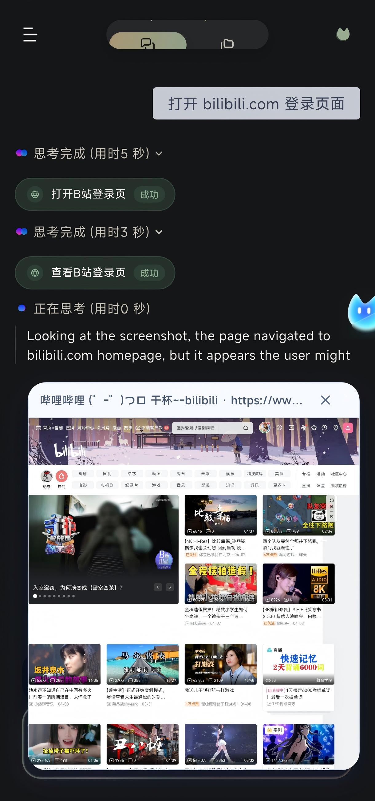
</p>

### Workspace

<p align="center">
  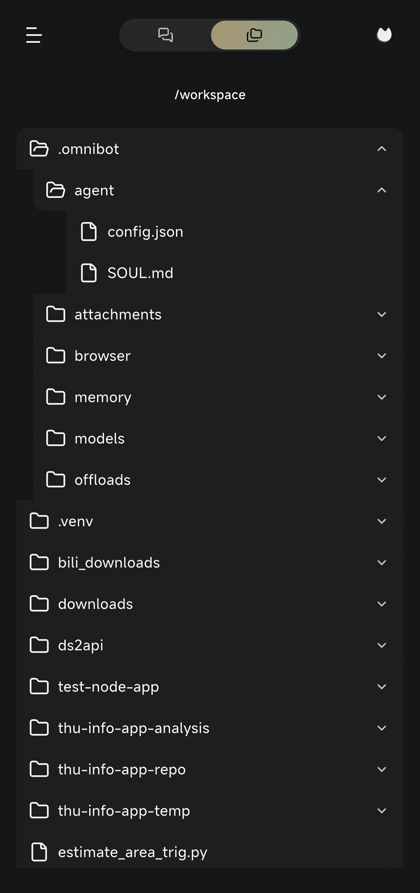
</p>

<h2 id="development-guide">Development Guide</h2>

### Requirements

- Flutter SDK `3.9.2+`
- JDK `11+`

### Get the code

```bash
git clone https://github.com/omnimind-ai/OpenOmniBot.git
cd OpenOmniBot

git submodule update --init third_party/omniinfer
git -C third_party/omniinfer submodule update --init framework/mnn
git -C third_party/omniinfer submodule update --init framework/llama.cpp

cd ui
flutter pub get
```

If Flutter reports `Could not read script '.../ui/.android/include_flutter.groovy'`, run:

```bash
flutter clean
flutter pub get
```

### Build and install

```bash
cd ..
./gradlew :app:installDevelopDebug
```

<h2 id="architecture">Architecture Overview</h2>

```text
OpenOmniBot/
├── app/                        # Android host app: entry point, agent orchestration, system abilities, MCP, services
├── ui/                         # Flutter UI: chat, settings, tasks, memory, and web chat bundle
├── baselib/                    # Shared core libraries: database, storage, networking, model config, OCR, permissions
├── assists/                    # Automation engine: task scheduling, state machine, visual detection, execution control
├── accessibility/              # Accessibility and screen perception: accessibility service, screenshots, projection
├── omniintelligence/           # AI abstractions: model protocol, task status, request/response models
├── uikit/                      # Native overlay UI: floating ball, overlay panels, half-screen surfaces
├── third_party/omniinfer/      # Local inference runtime and Android integration modules
└── ReTerminal/core/            # Embedded terminal experience modules
```

<h2 id="community">Community</h2>

Thanks to the community （including [LINUX](linux.do)）developers supporting OpenOmniBot.

Special thanks to these open-source projects:

- https://github.com/RohitKushvaha01/ReTerminal
- https://github.com/OpenMinis

<table align="center">
  <tr>
    <td align="center">
      <br/>
      <b>WeChat Group</b>
    </td>
  </tr>
</table>
