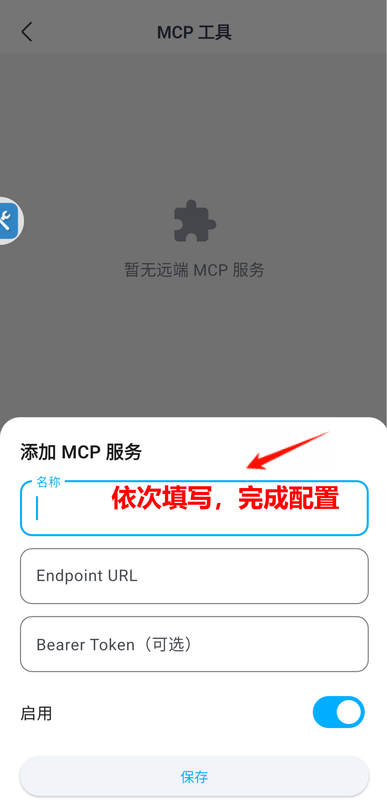
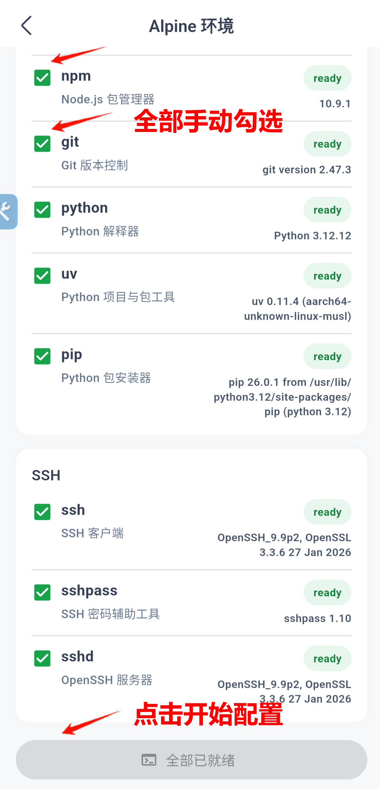

<p align="center">
  <picture>
    
  </picture>
</p>

<h3 align="center">
你的端侧 AI 助手
</h3>

<div align="center">
  
  <a href="https://github.com/omnimind-ai/OpenOmniBot/releases/latest"></a>
  <br>
  <a href="https://omnimind.com.cn"></a>
  <a href="https://linux.do"></a>
  <a href="#其他">
    
  </a>
</div>

<p align="center">
  <a href="README.md">English</a> | <a href="README_zh.md">简体中文</a>
</p>

<p align="center">
| 
<a href="#-demo"><b>Demo</b></a> 
| 
<a href="#-快速开始"><b>Quick Start</b></a> 
| 
<a href="https://github.com/omnimind-ai/OpenOmniBot/releases"><b>Release</b></a> 
|
<a href="https://github.com/omnimind-ai/OmniInfer-LLM/issues"><b>Issues</b></a> 
|
</p>

## ✨ 项目简介
OpenOmniBot 是一个基于 Android 原生与 Flutter 混合架构的智能机器人助手应用。
与传统 AI App 不同，它关注的是：**从理解 → 决策 → 执行 → 反馈的完整闭环**, 是一个 Android 端真正可"执行"的 Agent。

## 🧠 核心能力：

- 🧩 **工具生态扩展**：Skills、Alpine 系统、浏览器、MCP、安卓系统工具...

- 📱 **手机任务自动化**：支持用视觉模型操作手机界面。

- ⏰ **系统级能力**：支持定时任务、闹钟提醒、日历事件创建/查询/修改、音频播放控制。

- 🧬 **记忆系统**：短期与长期记忆嵌入。

- 🔨 **生产力工具**：支持读写文件、浏览工作区、调用浏览器、调用终端。


## 🚀 开发指南

### 环境要求

- Flutter SDK (3.9.2+)
- JDK 11+

### 获取代码

```bash
git clone https://github.com/omnimind-ai/OpenOmniBot.git
cd OpenOmniBot

#安装 Flutter 依赖
cd ui
flutter pub get
```

### 构建并安装
```bash
cd .. # 回到根目录下
./gradlew :app:installDevelopDebug
```

## 🚀 快速开始

> 以下步骤帮你从零配置小万，预计 15 分钟即可完成。

---

### 第一步：配置模型提供商

#### 填写服务商信息

`设置` → `模型提供商`

填入你的 LLM 服务商信息。以阿里云百炼为例：

| 配置项 | 值 |
|-------|-----|
| **API URL** | `https://dashscope.aliyuncs.com/compatible-mode/v1` |
| **API Key** | `sk-xxxxxxxxxxxxxxxxxxxxxxxx`（替换为你自己的 Key） |
| **模型** | `qwen3.6-plus`（推荐） |

<p align="center">
  
</p>

支持任何 OpenAI 兼容格式的提供商（DeepSeek、OpenRouter、本地 Ollama 等），只需替换 URL 和 Key。
#### 验证
回到聊天界面，发送"你好"，收到正常回复即表示配置成功。

---

### 第二步：了解内置能力与工具配置

#### 2.1 内置能力

配置好模型后，小万已经可以聊天了。除此之外，以下能力开箱即用，无需额外配置：

| 能力 | 说明 | 示例指令 |
|------|------|---------|
| 📱 设备自动化 | 操作手机界面：点击、输入、滑动 | "帮我打开微信并发送一条消息" |
| ⏰ 时间管理 | 设置闹钟/提醒、创建/查询/修改日历事件 | "明天早上 9 点提醒我开会" |
| 📂 文件处理 | 读写/搜索工作区文件、管理目录结构 | "帮我在工作区新建一个项目文件夹" |
| 🌐 网页交互 | 浏览网页：导航、截图、提取内容 | "帮我搜索一下上海明天的天气" |
| 🎵 多媒体控制 | 播放本地/网络音频、控制系统媒体播放 | "暂停当前音乐" |
| 🧬 记忆系统 | 记录重要信息到长期记忆 | "请记住我对坚果过敏" |

以下两项需要手动配置：

#### 2.2 MCP 工具

`设置` → `MCP 工具`

MCP（Model Context Protocol）让小万能调用外部工具服务，获取实时信息、操作本地服务等。

1. 进入 MCP 配置页面，点击新建 MCP 工具
2. 填入服务器地址（Endpoint URL），如 `http://127.0.0.1:xxxx`
3. 填入密钥（Bearer Token）用于鉴权

<p align="center">
  
</p>

**验证：** 回到聊天界面，让小万调用你配置的 MCP 工具，成功返回结果即可。

#### 2.3 Alpine 终端

`设置` → `Alpine 环境`

小万内置了一个轻量 Linux（Alpine）环境，可以直接执行终端命令、跑脚本、管理 Python 虚拟环境等。

| 区域 | 包含工具 | 状态 |
|------|---------|------|
| 环境配置 | Alpine 基础环境 | `ready` / `lost` |
| 开发环境 | Node.js、npm、Git、Python、uv、pip | `ready` / `lost` |
| SSH | ssh、sshpass、sshd | `ready` / `lost` |

点击页面底部的「开始配置」，等待环境下载安装。安装完成后各工具状态会从 `lost` 变为 `ready`。SSH 为可选项。

<p align="center">
  
</p>

**验证：** 对小万说"帮我用终端执行一个 ls 命令"，看到执行结果即可。

<details>
<summary>扩展：skill-creator 技能</summary>

小万内置了 `skill-creator` 技能，位于 `/workspace/.omnibot/skills/skill-creator`，可以帮你创建自定义技能（如天气查询、自动化脚本等）。试试对小万说："帮我创建一个查询天气的技能"。

</details>

---

### 第三步：个性化配置

#### 3.1 SOUL.md — 自定义人格

`设置` → `Workspace 记忆配置` → `SOUL.md（Agent 灵魂）`

SOUL.md 是小万的人格配置文件，会注入到每轮对话的 System Prompt 中。你可以定义身份、语气和行为边界：

```markdown
## 身份
你是「小万」，一个专业的法律顾问助手。

## 语气
- 使用正式、专业的语言
- 适当引用法条编号

## 行为边界
- 不提供具体的法律建议，仅做信息整理
- 复杂问题建议用户咨询执业律师
```

你也可以在对话中直接说"请记住你是一个美食博主"，授权后小万会自动更新 SOUL.md。

<details>
<summary>记忆系统说明</summary>

| 记忆类型 | 说明 | 存储方式 |
|---------|------|---------|
| 短期记忆 | 当前对话上下文 | 会话内自动维护 |
| 长期记忆 | 跨对话持久化的用户偏好与知识 | 向量化嵌入存储 |
| SOUL.md | Agent 人格与行为规则 | Workspace 文件 |
| Memory Rollup | 每日记忆整理与归纳 | 定时自动执行 |

</details>

**验证：** 编辑 SOUL.md 并保存，开一个新对话，观察回复风格是否符合你的设定。

#### 3.2 场景模型配置

`设置` → `场景模型配置`

小万内部有多个场景，各负责不同职责。默认所有场景共用第一步设置的模型，你也可以为特定场景指定不同模型来优化效果或节省成本：

| 场景 | 职责 | 选模型建议 |
|------|------|-----------|
| Agent | 理解意图、决策调度 | 最聪明的模型 |
| Operation | GUI 自动化执行 | 响应快的视觉模型 |
| Compactor | 上下文压缩纠错 | 性价比高的模型 |
| Chat Compactor | 聊天历史总结 | 性价比高的模型 |
| Loading | 生成等待提示文案 | 最便宜的即可 |
| Memory Embed | 记忆向量化 | Embedding 模型 |
| Memory Rollup | 每日记忆整理 | 性价比高的模型 |

选择「恢复默认」可随时还原。

<p align="center">
  
</p>

---

### 第四步：使用子代理（SubAgent）

#### 4.1 对话中使用子代理

当任务比较复杂时，小万可以将其拆分为多个子任务并行处理。无需额外配置，直接在对话中使用：

```
帮我使用子代理同时做三件事：
1. 查一下今天的科技新闻
2. 总结一下我昨天的会议纪要
3. 写一段明天团建的开场白
```

小万会派出最多 6 个子代理并行执行，汇总后返回结果。

#### 4.2 定时子代理任务

你也可以让小万定时自动执行子代理任务：

```
每天 18:00 帮我总结今天学到的新知识。
```

设置后可在「定时」→「定时任务」页面查看和管理。

---

### 配置总览

| 步骤 | 内容 | 配置路径 |
|------|------|----------|
| 第一步 | 配置模型提供商 | `设置` → `模型提供商` |
| 第二步 | 内置能力 / MCP / Alpine | 内置开箱即用 / `设置` → `MCP 工具` / `Alpine 环境` |
| 第三步 | 人格与场景模型 | `设置` → `Workspace 记忆配置` / `场景模型配置` |
| 第四步 | 子代理 | 对话中直接使用 |

## 🧪 Demo
<table width="100%">
  <tr>
    <td width="20%" align="center">
      <div>
        <p><strong>下载抖音视频Skill演示</strong></p>
        <video src="https://github.com/user-attachments/assets/8dbe772a-b300-4d52-9428-c3030fbf97a8" controls="controls" style="max-width: 100%;"></video>
      </div>
    </td>
    <td width="20%" align="center">
      <div>
        <p><strong>手机任务执行</strong></p>
        <video src="https://github.com/user-attachments/assets/a9a22755-e6fb-43d9-8647-1bc62549a1da" controls="controls" style="max-width: 100%;"></video>
      </div>
    </td>
    <td width="20%" align="center">
      <div>
        <p><strong>定时任务演示</strong></p>
        <video src="https://github.com/user-attachments/assets/9bc78501-55ab-4c41-837d-5b8c6589e352" controls="controls" style="max-width: 100%;"></video>
      </div>
    </td>
    <td width="20%" align="center">
      <div>
        <p><strong>原生OpenClaw演示</strong></p>
        <video src="https://github.com/user-attachments/assets/45b235ae-17fb-4af6-89f0-03419a063441" controls="controls" style="max-width: 100%;"></video>
      </div>
    </td>
  </tr>
</table>

## 🏗️ 架构概览
```
OpenOmniBot/
├── app/                 # Android 主宿主模块：App 入口、Agent 编排、系统能力、MCP、前台服务
├── ui/                  # Flutter UI 模块：聊天、设置、任务、记忆等界面（Riverpod + GoRouter）
├── baselib/             # 基础核心库：数据库、网络、存储、模型配置、OCR、权限、设备信息
├── assists/             # 自动化执行引擎：任务调度、状态机、视觉检测、操作控制
├── accessibility/       # 无障碍与屏幕感知：Accessibility Service、截图、MediaProjection
├── omniintelligence/    # 智能能力抽象层：模型协议、任务状态、Agent 请求/响应模型
└── uikit/               # 原生浮窗/覆盖层 UI：Overlay、悬浮球、半屏面板
```

## 其他
感谢社区的开发者的支持；

感谢优秀的开源项目：https://github.com/RohitKushvaha01/ReTerminal、https://github.com/OpenMinis

<table align="center">
  <tr>
    <td align="center">
      <br/>
      <b>WeChat Group</b>
    </td>
  </tr>
</table>
